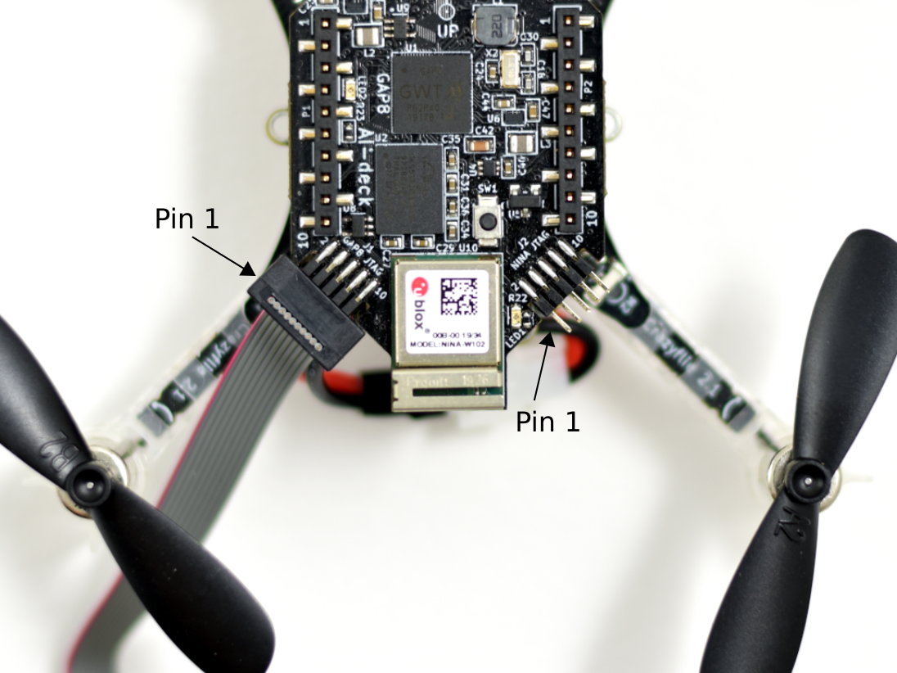

## JTAG adapter/debugger
The GAP8 SDK has recently added support for OpenOCD and debuggers with a ftdi interface should be usable. We have tested the Olimex ARM-USB-TINY-H with success and also the JLINK. The same applies for the ESP32 and a rule of thump is that if the JTAG debugger is compatible with the ESP32, it also works for the GAP8. The STLink v2 will not work as it can only debug Cortex cores.

Tested programmers:
- Olimex ARM-USB-TINY-H
- [ESP-prog](https://www.digikey.se/product-detail/en/schtoeta-engineering-limited/ESP-PROG/1965-ESP-PROG-ND/10259352?utm_adgroup=Programmers%2C%20Emulators%2C%20Debuggers&utm_source=google&utm_medium=cpc&utm_campaign=Shopping_Product_Development%20Boards%2C%20Kits%2C%20Programmers&utm_term=&productid=10259352&gclid=EAIaIQobChMIzPWTjq7y6QIVA8AYCh01ywkxEAYYASABEgK-NfD_BwE) (it is not part of the gap_sdk yet, so you need to get this file in your openocd list of programmers: [esp32_devkitj_v1.cfg.cdf](https://github.com/espressif/openocd-esp32/blob/master/tcl/interface/ftdi/esp32_devkitj_v1.cfg))

## JTAG connectors
There are two Cortex-M 10pin (2×5, 1.27mm pitch) JTAG interfaces on the AI-deck so that both the GAP8 and the ESP32 can be programmed and debugged easily. They are edge mounted on the PCB to save hight. The GAP8 JTAG is located on the left side and the ESP32 JTAG to the right when viewing the board from top and camera front. Note that pin-1 is located to the left, marked with a 1 on the bottom side of the board.

Use a 2×5 pin 1.27mm (0.05“) flat cable together with our [debug adapter](https://www.bitcraze.io/debug-adapter-kit)or e.g. an adapter such as the [Olimex ARM-JTAG-20-10](https://www.olimex.com/Products/ARM/JTAG/ARM-JTAG-20-10), is needed to connect the debugger and the AI-deck. The ESP-PROG normally comes with the right cable.

## Programming/Debugging
For details follow each MCUs guide. The [getting started guide](/docs/getting-started/getting-started.md) contain basic instructions as well.

ESP32 JTAG Debugging
https://docs.espressif.com/projects/esp-idf/en/latest/esp32/api-guides/jtag-debugging/index.html

GAP8 JTAG debugging
https://github.com/GreenWaves-Technologies/gap_sdk#openocd
